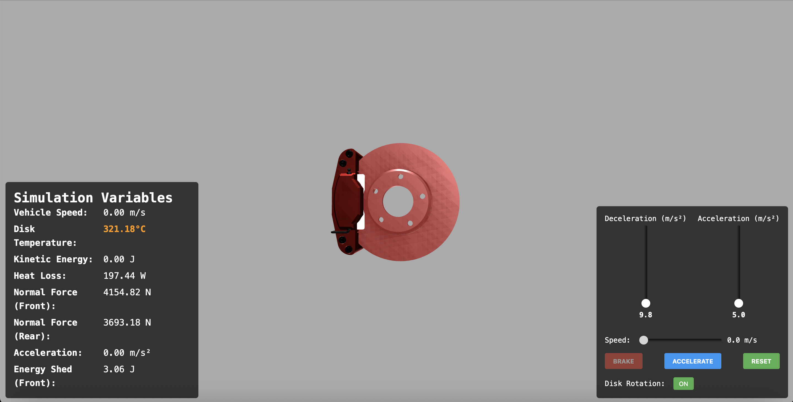

# 🔧 Digital Twin of a Disk Brake – Thermal Simulation

## 🚗 Overview

This project implements a **Digital Twin** of a **Disk Brake** to simulate the **temperature dynamics** of the brake disc under real-world driving conditions.

Using **physics-based modeling** and **thermodynamic principles**, it calculates how the disc temperature evolves over time based on:

- **Kinetic and potential energy transformations**
- **Heat generation from braking forces**
- **Heat dissipation** through:
  - Radiation
  - Conduction
  - Convection
- **Energy losses** from:
  - Air resistance

This simulation models the **front braking system** of my **Suzuki Ignis**, with all physical constants and parameters customized for the vehicle. It serves as a **simulation backend** for **automotive digital twin** applications such as:

- **Real-time monitoring** of brake performance and **brake fade due to overheating**
- **Predictive maintenance** using live sensor data
- **Design optimization** of braking systems under different operating conditions

---

## 📐 Core Concepts Modeled

### 🧮 Physics-Based Calculations

| Physical Effect              | Modeled Through                                      |
|-----------------------------|------------------------------------------------------|
| Braking Energy              | Work-energy principle from kinetic energy           |
| Heat Generation             | Frictional work converted into heat                 |
| Heat Loss: Radiation        | Stefan–Boltzmann law                                |
| Heat Loss: Convection       | Newton’s law of cooling                             |
| Air Drag                    | Modeled as additional resistive forces              |

---

## 🧊 Thermal Simulation Workflow

1. **Initial Conditions**
   - Vehicle-specific parameters: speed, mass, front/rear weight distribution, wheelbase, height of COG, drag coefficient, frontal area
   - Brake disc properties: mass, surface area, heat capacity
   - Ambient temperature and airflow

2. **Energy Balance**
   - Compute loss in kinetic and potential energy per time-step
   - Calculate heat generated from brake force applied

3. **Thermal Dynamics**
   - Update disc temperature using radiation, convection, and conduction heat loss models
   - Incorporate additional work done by air drag and transmission loss

---

## ⚙️ Tech Stack

- **Language:** JavaScript
- **Visualization:** [Three.js](https://threejs.org) for 3D modeling and rendering of the braking system
- **Modeling:** Custom physics equations implemented manually

Additionally, the simulation includes **dynamic weight transfer to the front axle during braking**, enhancing the realism of brake force and heat generation calculations.

---

## 🚀 Getting Started

Check out the live simulation here:  
👉 [https://digital-twin-assignment1.vercel.app](https://digital-twin-assignment1.vercel.app)

> ⚠️ Best viewed on desktop with modern browsers.

---

## 🔮 Future Enhancements

- [ ] Add rear disc simulation with biasing control
- [ ] Use realtime speed input from obd scanner
- [ ] Add support for terrain and slope-based braking scenarios
- [ ] Export simulation data for ML model training

---

## 🤝 Contributing

Open to collaboration and feature suggestions.  
Feel free to fork the repo, raise issues, or submit pull requests!

---

## 📜 License

MIT License – free to use, modify, and distribute.

---

## 🧠 Author

- **[Srivishnu](https://github.com/SrivishnuGade)**  
  📧 gade.srivishnu@gmail.com

- **[Tejas](https://github.com/tejasnaikj)**  
  📧 tejasnaikj7887@gmail.com

🚗 Car: Suzuki Ignis (front brake parameters configured)

